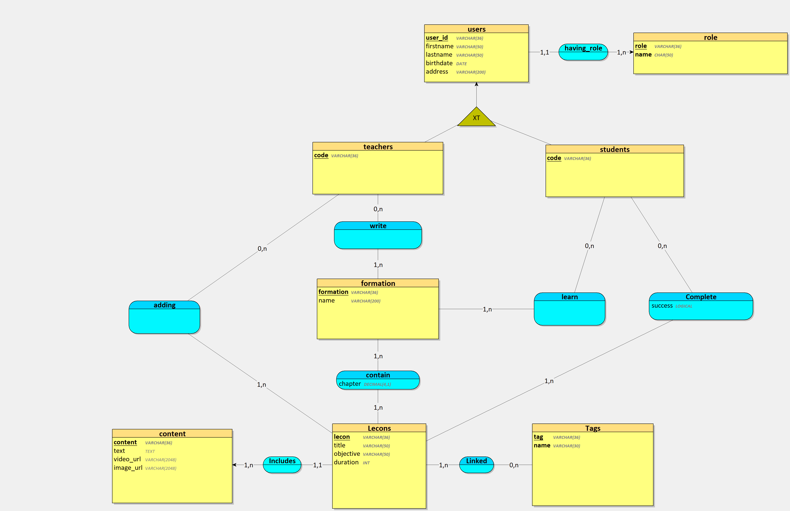
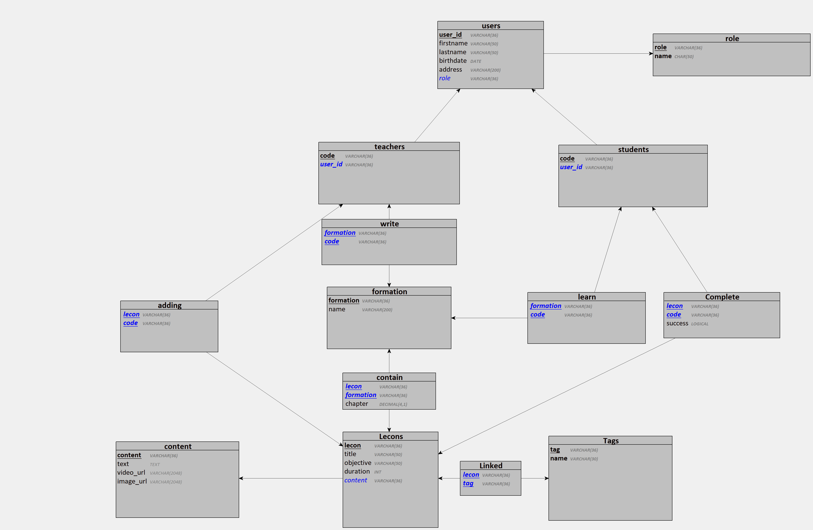

# Merise-MCD-MLD-MPD

---

##### Contexte du projet

Les formations sont organisés en modules.

Chaque module est caractérisé par un numéro de module sous forme de Semantic Versionning, un intitulé, un objectif pédagogique, un contenu (textes, images et vidéos), une durée en heures, un ou plusieurs tags et un auteur.

Un module peut faire partie d'une ou plusieurs formations, comme par exemple un pire module "Commandes de base Git" pourrait faire partie d'une pire formation "Frontend Javascript" et "DevOps", voir  plus.

Un module peut contenir un texte et/ou une image et/ou une vidéo.

Les apprenants peuvent s'inscrire à une ou plusieurs formations, ils peuvent choisir de ne pas suivre certains des modules s'ils possèdent déjà, par exemple, les compétences. Autrement dit, ils peuvent arbitrairement valider les modules de leur choix en un clic.

Chaque apprenant est évalué pour chaque module et possède un état de fin de module (OK / KO).

Une formation est considérée comme terminée lorsque tous les modules ont été validés.

Chaque apprenant est caractérisé par un numéro d’inscription unique, un nom, un prénom, une adresse et une date de naissance.

Un formateurs est auteur d'un module pour une formation donnée, chaque formateur est caractérisé par un code, un nom, un prénom.

#### Modalités pédagogiques
* Travail en groupe
* Rendu individuel
* Livraison Mardi 09 Août 2022 17h

#### Critères de performance
* La nomenclature MERISE est respectée
* Le méthode MERISE est respectée dans sa structure en découpant la conception de cette base de données en 3 niveaux : le niveau conceptuel, le niveau logique ou organisationnel, le niveau physique

#### Modalités d'évaluation
Revue des diagrammes sur le dépôt Git.

#### Livrables
- Un dépôt Github recensant : 
    - Un README explicite et soigné
    - Une définition de l'acronyme MERISE dans le README.md
    - Un dictionnaire de données
    - Des règles de gestion
    - Un MCD
    - Un MLD
    - Un MPD
    - Un script SQL de la base de données
--- 
# Merise
*`` Méthode d'étude et de réalisation informatique pour les systèmes d'entreprise ``*

Le principe de Merise est de ***séparer les données des traitements***. L'organisation des données semble donc plus pérenne que la définition des traitemens, car ils évoluent en fonction des utilisateurs, de l'évolution des métiers ainsi que des fonctions.

## Règles de gestion

### Utilisateurs

- Un utilisateur doit renseigner un **prénom**, un **nom**, une **adresse** et **date de naissance**;

- Les utilisateurs ont soit un **rôle** d'enseignant ( **teacher** ) ou un rôle d'apprenant ( **student** );

- Les utilisateurs ont un ***rôle "user" par défaut*** tant qu'ils n'ont pas renseigner un rôle;

### Professeurs

- Chaque professeur à un **code d'enseignant** unique;

- Un professeur peut créer plusieurs formations;

- Un professeur peut ajouter des modules de formation existents à la sienne ou en créer de nouveaux;

- Un module de formation doit contenir obligatoirement un **text**, la **vidéo** et l'**image** sont optionnelles;

- Les modules sont reliés à leurs auteurs ( professeurs ). Une formation peut donc contenir des modules postés par plusieurs professeurs;


- Les modules sont liés à un ou plusieurs **tags**, ils ont pour but d'indiquer les notions enseignées dans un module;

- Les chapitres d'une formation sont donc divisés en modules, ils sont donc caractérisé par un marquage sémantique;

### Etudiants

- Un étudiant possède un **code d'étudiant unique**;

- Un étudiant peut suivre une à plusieurs formations;

- Un étudiant peut compléter les modules de ces formations suivies, il peut le faire de manière arbitraire si il a déjà acquis la compétence enseigné dans un module;

---

# Dictionnaire de données

| Entités   |       Propriétés      |    Types    |               Description                |    Exemple    |
|-----------|-----------------------|-------------|------------------------------------------| --------------|
| ``Users`` | **user_id**           | uuid | ***Identifiant*** de l'utilisateur              |123e4567-e89b-12d3-a456-426614174000
| ``Users`` | **firstname**         | Varchar(50) | ***Prénom*** de l'utilisateur            | John
| ``Users`` | **lastname**          | Varchar(50) | ***Nom*** de l'utilisateur               | Doe
| ``Users`` | **birthdate**         | Date        | ***Date de naissance*** de l'utilisateur | 20/05/1984
| ``Users`` | **address**           | Varchar(200)| ***Adresse*** de l'utilisateur           | 50 rue de l'égalité, 59000 Lille, France.
| ``Role``  | **role**              | uuid        | ***Identifiant*** du role                | 123e4567-e89b-12d3-a456-426614174000
| ``Role``  | **name**              | Varchar(36) | ***Nom*** du role                        | Teacher
| ``teacher`` | **code**            | uuid        | ***Identifiant*** du professeur          | 123e4567-e89b-12d3-a456-426614174000
| ``student`` | **code**            | uuid        | ***Identifiant*** de l'élève             | 123e4567-e89b-12d3-a456-426614174000
| ``Complete`` | **success**   | Boolean        | ***Statut*** d'avancement d'un module d'un élève ( complet, incomplet ) | true / false
| ``Formation`` | **formation**   | uuid        | ***Identifiant*** de la formation | 123e4567-e89b-12d3-a456-426614174000
| ``Formation`` | **name**   | Varchar(200)        | ***Nom*** de la formation | Les bases de Git en 10 modules !
| ``Contain`` | **chapter**    | Decimal(4,1) | ***Numéro de Chapitre*** ( semantic versioning) d'un module dans une formation               | 12.3
| ``Modules`` | **module**   | uuid        | ***Identifiant*** du module| 123e4567-e89b-12d3-a456-426614174000
| ``Modules`` | **title**   | Varchar(200)        | ***titre*** du module | Installer le CLI de Git
| ``Content`` | **content**   | uuid        | ***Identifiant*** du module| 123e4567-e89b-12d3-a456-426614174000
| ``Content`` | **text**   | TEXT        | ***Contenu*** du module | *Contenu écrit complet d'un module de formation...*
| ``Content`` | **video_url**   | Varchar(2048)        | ***URL***  d'une vidéo à diffuser dans le module  |https://foo.com/gtv-videos-bucket/sample/foo.mp4
| ``Content`` | **image_url**   | Varchar(2048)        | ***URL***  d'une image à afficher dans le module  |https://foo.com/gtv-images-bucket/sample/foo.png
| ``Tags`` | **tag**    | uuid        | ***Identifiant*** du module| 123e4567-e89b-12d3-a456-426614174000
| ``Tags`` | **name**    | Varchar(30) | ***Nom*** du tag               | Git

---

***Les MCD, MLD et MPD suivant ont été mis en place pour le SGBDR PostgreSQL```***

# MCD 
###### Modèle Conceptuel


# MPD
###### Modèle Physique


# MLD
###### Modèle Logique
***Représentation textuelle du MPD***

```
Tags = (tag VARCHAR(36) , name VARCHAR(30) );
content = (content VARCHAR(36) , text TEXT, video_url VARCHAR(2048) , image_url VARCHAR(2048) );
formation = (formation VARCHAR(36) , name VARCHAR(200) );
role = (role VARCHAR(36) , name CHAR(50) );
Lessons = (lesson VARCHAR(36) , title VARCHAR(50) , objective VARCHAR(50) , duration INTEGER, #content);
users = (user_id VARCHAR(36) , firstname VARCHAR(50) , lastname VARCHAR(50) , birthdate DATE, address VARCHAR(200) , #role);
teachers = (code VARCHAR(36) , #user_id);
students = (code VARCHAR(36) , #user_id);
Linked = (#lesson, #tag);
contain = (#lesson, #formation, chapter NUMERIC(4,1)  );
write = (#formation, #code);
adding = (#lesson, #code);
learn = (#formation, #code);
Complete = (#lesson, #code, success BOOLEAN);

```

# Script SQl
```SQL
CREATE TABLE Tags(
   tag VARCHAR(36) ,
   name VARCHAR(30)  NOT NULL,
   PRIMARY KEY(tag),
   UNIQUE(name)
);

CREATE TABLE content(
   content VARCHAR(36) ,
   text TEXT,
   video_url VARCHAR(2048) ,
   image_url VARCHAR(2048) ,
   PRIMARY KEY(content)
);

CREATE TABLE formation(
   formation VARCHAR(36) ,
   name VARCHAR(200)  NOT NULL,
   PRIMARY KEY(formation)
);

CREATE TABLE role(
   role VARCHAR(36) ,
   name CHAR(50)  NOT NULL,
   PRIMARY KEY(role),
   UNIQUE(name)
);

CREATE TABLE Lessons(
   lesson VARCHAR(36) ,
   title VARCHAR(50)  NOT NULL,
   objective VARCHAR(50)  NOT NULL,
   duration INTEGER NOT NULL,
   content VARCHAR(36)  NOT NULL,
   PRIMARY KEY(lesson),
   FOREIGN KEY(content) REFERENCES content(content)
);

CREATE TABLE users(
   user_id VARCHAR(36) ,
   firstname VARCHAR(50)  NOT NULL,
   lastname VARCHAR(50)  NOT NULL,
   birthdate DATE NOT NULL,
   address VARCHAR(200)  NOT NULL,
   role VARCHAR(36)  NOT NULL,
   PRIMARY KEY(user_id),
   FOREIGN KEY(role) REFERENCES role(role)
);

CREATE TABLE teachers(
   code VARCHAR(36) ,
   user_id VARCHAR(36)  NOT NULL,
   PRIMARY KEY(code),
   UNIQUE(user_id),
   FOREIGN KEY(user_id) REFERENCES users(user_id)
);

CREATE TABLE students(
   code VARCHAR(36) ,
   user_id VARCHAR(36)  NOT NULL,
   PRIMARY KEY(code),
   UNIQUE(user_id),
   FOREIGN KEY(user_id) REFERENCES users(user_id)
);

CREATE TABLE Linked(
   lesson VARCHAR(36) ,
   tag VARCHAR(36) ,
   PRIMARY KEY(lesson, tag),
   FOREIGN KEY(lesson) REFERENCES Lessons(lesson),
   FOREIGN KEY(tag) REFERENCES Tags(tag)
);

CREATE TABLE contain(
   lesson VARCHAR(36) ,
   formation VARCHAR(36) ,
   chapter NUMERIC(4,1)   NOT NULL,
   PRIMARY KEY(lesson, formation),
   FOREIGN KEY(lesson) REFERENCES Lessons(lesson),
   FOREIGN KEY(formation) REFERENCES formation(formation)
);

CREATE TABLE write(
   formation VARCHAR(36) ,
   code VARCHAR(36) ,
   PRIMARY KEY(formation, code),
   FOREIGN KEY(formation) REFERENCES formation(formation),
   FOREIGN KEY(code) REFERENCES teachers(code)
);

CREATE TABLE adding(
   lesson VARCHAR(36) ,
   code VARCHAR(36) ,
   PRIMARY KEY(lesson, code),
   FOREIGN KEY(lesson) REFERENCES Lessons(lesson),
   FOREIGN KEY(code) REFERENCES teachers(code)
);

CREATE TABLE learn(
   formation VARCHAR(36) ,
   code VARCHAR(36) ,
   PRIMARY KEY(formation, code),
   FOREIGN KEY(formation) REFERENCES formation(formation),
   FOREIGN KEY(code) REFERENCES students(code)
);

CREATE TABLE Complete(
   lesson VARCHAR(36) ,
   code VARCHAR(36) ,
   success BOOLEAN NOT NULL,
   PRIMARY KEY(lesson, code),
   FOREIGN KEY(lesson) REFERENCES Lessons(lesson),
   FOREIGN KEY(code) REFERENCES students(code)
);
```
